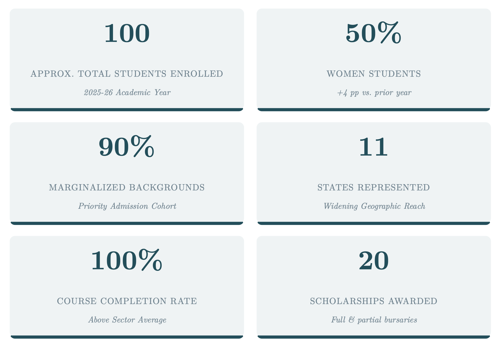
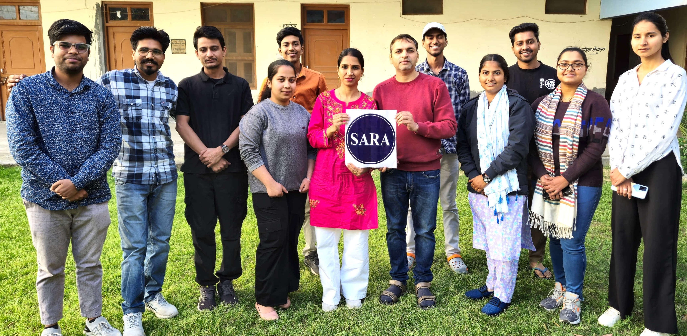
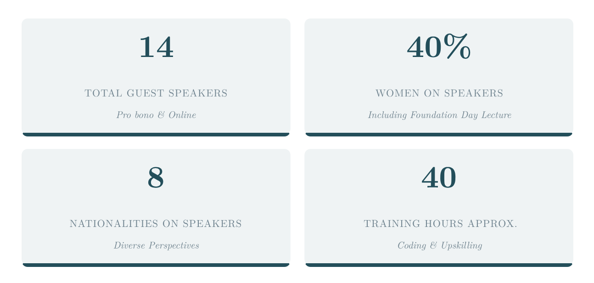
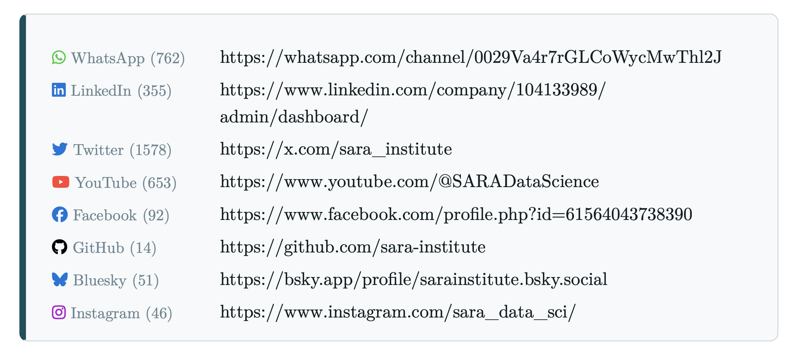
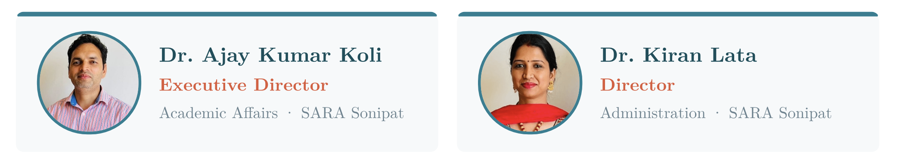

---
format:
  revealjs:
    slide-number: true
    progress: true
    transition: fade
    transition-speed: fast
    background-transition: fade
    logo: images/logo-sara.png
    #footer: "[SARA's 3rd Foundation Day · 4 April 2026]()"
    fig-align: center
    css: sara-theme.css
    pagetitle: "SARA 3rd Foundation Day Slides"
filters:
  - roughnotation
---

# [SARA's 3rd Foundation Day Talk 2026]{style="color: #001b3a;"} {background-image="images/3sara.gif" background-size="contain" background-position="90%"}

##  {background-image="https://images.unsplash.com/photo-1615715035868-fc94bd5ffdac?q=80&w=2070&auto=format&fit=crop&ixlib=rb-4.0.3&ixid=M3wxMjA3fDB8MHxwaG90by1wYWdlfHx8fGVufDB8fHx8fA%3D%3D" background-size="cover"}

 

::::::: centering
:::::: columns
::: {.column width="36%"}
![**MATA [SA]{.clr-red}VITRIBAI PHULE (1831-1897)** 🌺 🙏🏽
🌼](images/savitrimai.png){.oval}
:::

::: {.column width="29%"}
 

{width="2.0in" fig-align="center"}
:::

::: {.column width="34%"}
![**MATA [RA]{.clr-red}MABAI AMBEDKAR (1898-1935)** 🌺 🙏🏽
🌼](images/ramai.png){.oval}
:::
::::::

[**Savitribai Ramabai (SARA) Institute of Data Science**]{.r-fit-text}
:::::::

::: {.footer}
Started in April 2023
:::

## SARA's Mission ##  {background-image="images/lamp.png" background-size="25%" background-position="80% -10%" background-color="#001b3a"}

 

> [Democratise Data Science]{.clr-gold}

[Free, world-class data science education, with priority admission for marginalised communities and women.]{.rn-fragment rn-color="#C8963E"}

## 2025-26 Student's Overview {background-color="#001b3a"}

{fig-align="center"}

## Data Schools {background-color="#001b3a"}

::: {.panel-tabset}

### Summer School

::: {#fig-elephants layout-ncol=2}

{#fig-surus}

{#fig-hanno}

Participants of the SARA Summer Schools "R for Researchers"
:::

### Winter School 

::: {#fig-elephants layout-ncol=2}

{#fig-surus}

{#fig-hanno}

Participants of the SARA Winter Schools "Statistics using R"
:::

### Bootcamp

::: {#fig-elephants layout-ncol=2}

{#fig-surus}

{#fig-hanno}

Participants of the SARA Coding Bootcamps "Publish using Quarto"
:::

:::

## Bridge Courses {background-image="images/lamp.png" background-size="25%" background-position="80% -10%" background-color="#001b3a" }

- Computer Basic Skills

- English Language Skills

- [CUET - UG]{.clr-gold} 

# SARA Book Club {background-image="images/book-cover.jpg" background-size="contain" background-position="right" background-color="#001b3a" }

## Guest Speakers {background-image="images/guest-speakers.png" background-size="contain" background-position="right" background-color="#001b3a" }

::: {.columns}
::: {.column width=50%}

 
 

:::
::: {.column}
:::
:::
<!-- end columns -->

## {background-image="https://images.unsplash.com/photo-1615715035868-fc94bd5ffdac?q=80&w=2070&auto=format&fit=crop&ixlib=rb-4.0.3&ixid=M3wxMjA3fDB8MHxwaG90by1wYWdlfHx8fGVufDB8fHx8fA%3D%3D" background-size="cover"}

 
 

:::: {.centering}

[***The Ambedkar  Educational Society Sonipat***]{.r-fit-text}

Established in 1969 | Mr. Rajesh Kataria, President

::::

# Alison Presmanes Hill, PhD {background-image="images/alison-sara.jpeg" background-size="contain" background-position="125%" background-color="#001b3a" }

## SARA Annual Report {background-color="#001b3a"}

<iframe class="speakerdeck-iframe" style="border: 0px; background: padding-box rgba(0, 0, 0, 0.1); margin: 0px; padding: 0px; border-radius: 6px; box-shadow: rgba(0, 0, 0, 0.2) 0px 5px 40px; width: 100%; height: auto; aspect-ratio: 560 / 791;" frameborder="0" src="https://speakerdeck.com/player/f8bc312457894f99bb37b44883ebd6a7" title="SARA Annual Report 2025-26" allowfullscreen="true" data-ratio="0.7079646017699115"></iframe>

#  Donate to SARA {background-color="#001b3a" background-image="images/upi-sara.png" background-position="right" background-size="contain"}

## Social Media {background-color="#001b3a"}

::: {.centering}

[](https://github.com/sara-edu)  
[](https://twitter.com/sara_institute)  
[](https://www.facebook.com/profile.php?id=61564043738390)
  [](https://www.youtube.com/@SARADataScience)
 
[](https://www.linkedin.com/company/sara-institute/)
 
[](https://whatsapp.com/channel/0029Va4r7rGLCoWycMwThl2J)
 
[](https://www.instagram.com/sara_data_sci/)
:::

# Thank You {background-image="images/lamp.png" background-size="25%" background-position="80% -10%" background-color="#001b3a" }

